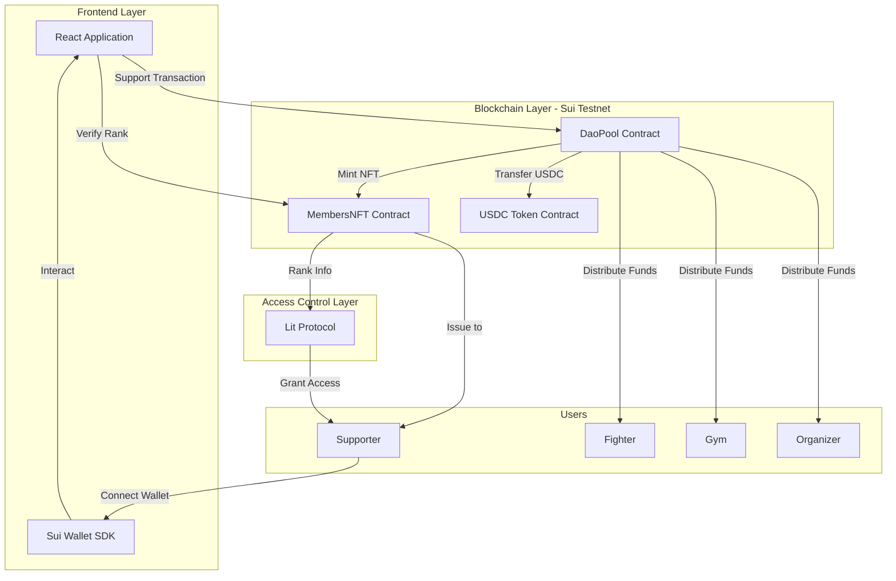
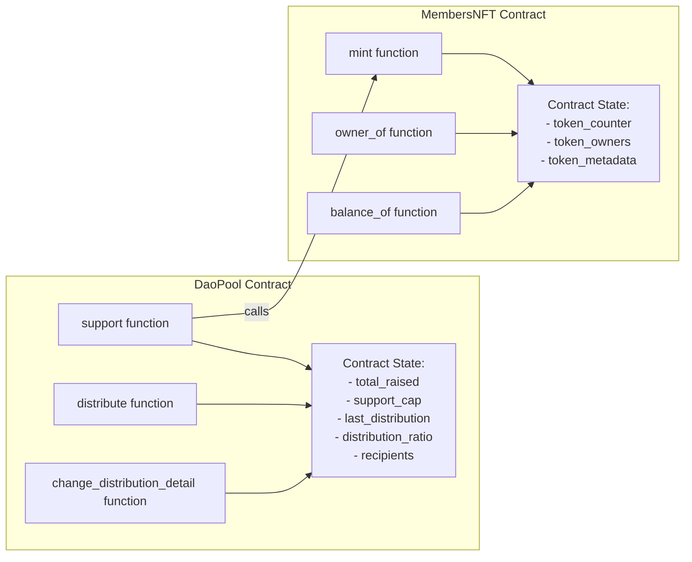

# Design Document

## Overview

CHAMPION TOGETHERは、Suiブロックチェーン上で動作する格闘家支援プラットフォームです。本システムは、以下の3つの主要コンポーネントで構成されます：

1. **DaoPool Contract (Move)**: 支援金の管理と自動分配を実行
2. **MembersNFT Contract (Move)**: 支援者への記念NFT発行と管理
3. **Frontend Application (React + Vite)**: ユーザーインターフェースとウォレット統合

システムは、ファンからの支援金（USDC）を受け付け、メンバーNFTを発行し、30日ごとに格闘家・ジム・後援会幹事に資金を自動分配します。

## Architecture

### High-Level Architecture



### Contract Architecture



## Components and Interfaces

### 1. DaoPool Contract (Move)

#### State Variables

```move
struct DaoPoolState has key {
    id: UID,
    total_raised: u64,              // 累計支援額（USDC単位、6桁精度）
    support_cap: u64,               // 支援上限（3,000 USDC = 3,000,000,000）
    last_distribution: u64,         // 最終分配日時（Unix timestamp）
    distribution_interval: u64,     // 分配間隔（30日 = 2,592,000秒）
    fighter_address: address,       // 格闘家のウォレットアドレス
    gym_address: address,           // ジムのウォレットアドレス
    organizer_address: address,     // 後援会幹事のウォレットアドレス
    fighter_ratio: u64,             // 格闘家への配分比率（例: 60）
    gym_ratio: u64,                 // ジムへの配分比率（例: 30）
    organizer_ratio: u64,           // 後援会幹事への配分比率（例: 10）
    treasury: Coin<USDC>,           // トレジャリー（USDC保管）
    nft_contract_id: ID,            // MembersNFT ContractのオブジェクトID
}
```

#### Functions

**support()**
```move
public entry fun support(
    state: &mut DaoPoolState,
    nft_contract: &mut MembersNFTState,
    payment: Coin<USDC>,
    ctx: &mut TxContext
)
```
- 支援者からUSDCを受け取る
- 支援上限チェック（total_raised + payment <= support_cap）
- トレジャリーに追加
- MembersNFT Contractのmint関数を呼び出し
- 支援額とタイムスタンプをイベントとして発行

**distribute()**
```move
public entry fun distribute(
    state: &mut DaoPoolState,
    clock: &Clock,
    ctx: &mut TxContext
)
```
- 分配間隔チェック（current_time - last_distribution >= distribution_interval）
- トレジャリー残高チェック（> 0）
- 配分比率に基づいて計算
  - fighter_amount = treasury * fighter_ratio / 100
  - gym_amount = treasury * gym_ratio / 100
  - organizer_amount = treasury * organizer_ratio / 100
- 各受取人に送金
- total_raisedをリセット
- last_distributionを更新
- 分配履歴をイベントとして発行

**change_distribution_detail()**
```move
public entry fun change_distribution_detail(
    state: &mut DaoPoolState,
    new_fighter_address: Option<address>,
    new_gym_address: Option<address>,
    new_organizer_address: Option<address>,
    new_fighter_ratio: Option<u64>,
    new_gym_ratio: Option<u64>,
    new_organizer_ratio: Option<u64>,
    ctx: &mut TxContext
)
```
- 呼び出し元がorganizer_addressであることを検証
- 新しいアドレスが指定されていれば更新
- 新しい配分比率が指定されていれば更新
- 配分比率の合計が100であることを検証
- 変更履歴をイベントとして発行

#### Events

```move
struct SupportEvent has copy, drop {
    supporter: address,
    amount: u64,
    timestamp: u64,
}

struct DistributionEvent has copy, drop {
    total_amount: u64,
    fighter_amount: u64,
    gym_amount: u64,
    organizer_amount: u64,
    timestamp: u64,
}

struct ConfigChangeEvent has copy, drop {
    changed_by: address,
    timestamp: u64,
}
```

### 2. MembersNFT Contract (Move)

#### State Variables

```move
struct MembersNFTState has key {
    id: UID,
    token_counter: u64,             // 発行済みトークン数
    dao_pool_id: ID,                // DaoPool ContractのオブジェクトID（認可用）
}

struct MemberNFT has key, store {
    id: UID,
    token_id: u64,                  // トークンID
    support_amount: u64,            // 支援額
    rank: String,                   // 会員ランク（Bronze, Silver, Gold, Platinum）
    minted_at: u64,                 // 発行日時
    image_url: String,              // NFT画像URL
}
```

#### Functions

**mint()**
```move
public fun mint(
    state: &mut MembersNFTState,
    support_amount: u64,
    recipient: address,
    clock: &Clock,
    ctx: &mut TxContext
): MemberNFT
```
- 呼び出し元がdao_pool_idと一致することを検証（DaoPool Contractからのみ呼び出し可能）
- 支援額に基づいてランクを決定
  - 10-49 USDC: Bronze
  - 50-99 USDC: Silver
  - 100-199 USDC: Gold
  - 200+ USDC: Platinum
- token_counterをインクリメント
- MemberNFTオブジェクトを作成
- recipientに転送
- MintEventを発行

**owner_of()**
```move
public fun owner_of(nft: &MemberNFT): address
```
- NFTの所有者アドレスを返す

**balance_of()**
```move
public fun balance_of(owner: address, ctx: &TxContext): u64
```
- 指定されたアドレスが保有するNFT数を返す
- Sui Dynamic Fieldsを使用して実装

**get_rank()**
```move
public fun get_rank(nft: &MemberNFT): String
```
- NFTの会員ランクを返す

#### Events

```move
struct MintEvent has copy, drop {
    token_id: u64,
    recipient: address,
    support_amount: u64,
    rank: String,
    timestamp: u64,
}
```

### 3. Frontend Application (React + Vite)

#### Component Structure

```
src/
├── App.tsx                     # メインアプリケーション
├── main.tsx                    # エントリーポイント
├── components/
│   ├── WalletConnect.tsx       # ウォレット接続コンポーネント
│   ├── SupportForm.tsx         # 支援フォーム
│   ├── ProgressBar.tsx         # 支援進捗バー
│   ├── NFTGallery.tsx          # 保有NFT一覧
│   ├── DistributionHistory.tsx # 分配履歴
│   └── ExclusiveContent.tsx    # 限定コンテンツ
├── hooks/
│   ├── useSuiWallet.ts         # ウォレット接続フック
│   ├── useDaoPool.ts           # DaoPool Contract操作フック
│   ├── useMembersNFT.ts        # MembersNFT Contract操作フック
│   └── useLitProtocol.ts       # Lit Protocol統合フック
├── utils/
│   ├── contractHelpers.ts      # コントラクト操作ヘルパー
│   ├── formatters.ts           # データフォーマット関数
│   └── constants.ts            # 定数定義
└── types/
    └── index.ts                # TypeScript型定義
```

#### Key Hooks

**useDaoPool.ts**
```typescript
export function useDaoPool() {
  const { mutate: support } = useMutation({
    mutationFn: async (amount: number) => {
      // DaoPool Contract の support 関数を呼び出し
    }
  });

  const { data: poolState } = useQuery({
    queryKey: ['daoPoolState'],
    queryFn: async () => {
      // DaoPool Contract の状態を取得
    }
  });

  return { support, poolState };
}
```

**useMembersNFT.ts**
```typescript
export function useMembersNFT(walletAddress?: string) {
  const { data: nfts } = useQuery({
    queryKey: ['memberNFTs', walletAddress],
    queryFn: async () => {
      // ユーザーが保有するNFTを取得
    },
    enabled: !!walletAddress
  });

  return { nfts };
}
```

**useLitProtocol.ts**
```typescript
export function useLitProtocol() {
  const checkAccess = async (
    contentId: string,
    requiredRank: string
  ): Promise<boolean> => {
    // Lit Protocol でアクセス権限をチェック
    // MembersNFT Contract から会員ランクを取得
    // 条件を満たすか評価
  };

  return { checkAccess };
}
```

#### UI Components

**SupportForm.tsx**
- 支援額入力フィールド
- 会員ランクプレビュー（入力額に応じて表示）
- 支援ボタン
- トランザクション状態表示（pending, success, error）

**ProgressBar.tsx**
- 累計支援額の進捗バー（0 - 3,000 USDC）
- 達成率パーセンテージ
- 次回分配までのカウントダウン

**NFTGallery.tsx**
- 保有NFTのグリッド表示
- 各NFTの詳細情報（ランク、支援額、発行日）
- NFT画像表示

**ExclusiveContent.tsx**
- 会員ランク別コンテンツリスト
- アクセス可能/不可能の表示
- Lit Protocolによるアクセス制御

## Data Models

### DaoPool State

| Field | Type | Description |
|-------|------|-------------|
| id | UID | オブジェクトID |
| total_raised | u64 | 累計支援額（マイクロUSDC） |
| support_cap | u64 | 支援上限（3,000,000,000） |
| last_distribution | u64 | 最終分配日時 |
| distribution_interval | u64 | 分配間隔（2,592,000秒） |
| fighter_address | address | 格闘家アドレス |
| gym_address | address | ジムアドレス |
| organizer_address | address | 後援会幹事アドレス |
| fighter_ratio | u64 | 格闘家配分比率（60） |
| gym_ratio | u64 | ジム配分比率（30） |
| organizer_ratio | u64 | 後援会幹事配分比率（10） |
| treasury | Coin<USDC> | トレジャリー |
| nft_contract_id | ID | NFTコントラクトID |

### MemberNFT

| Field | Type | Description |
|-------|------|-------------|
| id | UID | オブジェクトID |
| token_id | u64 | トークンID |
| support_amount | u64 | 支援額（マイクロUSDC） |
| rank | String | 会員ランク |
| minted_at | u64 | 発行日時 |
| image_url | String | NFT画像URL |

### Frontend Types

```typescript
interface PoolState {
  totalRaised: number;
  supportCap: number;
  lastDistribution: number;
  distributionInterval: number;
  fighterAddress: string;
  gymAddress: string;
  organizerAddress: string;
  fighterRatio: number;
  gymRatio: number;
  organizerRatio: number;
}

interface MemberNFT {
  tokenId: number;
  supportAmount: number;
  rank: 'Bronze' | 'Silver' | 'Gold' | 'Platinum';
  mintedAt: number;
  imageUrl: string;
  owner: string;
}

interface DistributionRecord {
  timestamp: number;
  totalAmount: number;
  fighterAmount: number;
  gymAmount: number;
  organizerAmount: number;
}
```

## Error Handling

### Smart Contract Errors

```move
// DaoPool Contract
const E_SUPPORT_CAP_REACHED: u64 = 1;
const E_INSUFFICIENT_AMOUNT: u64 = 2;
const E_DISTRIBUTION_TOO_EARLY: u64 = 3;
const E_EMPTY_TREASURY: u64 = 4;
const E_UNAUTHORIZED: u64 = 5;
const E_INVALID_RATIO: u64 = 6;

// MembersNFT Contract
const E_UNAUTHORIZED_MINTER: u64 = 1;
const E_INVALID_SUPPORT_AMOUNT: u64 = 2;
const E_TOKEN_NOT_FOUND: u64 = 3;
```

### Frontend Error Handling

```typescript
enum ErrorType {
  WALLET_NOT_CONNECTED = 'ウォレットが接続されていません',
  INSUFFICIENT_BALANCE = 'ウォレット残高が不足しています',
  SUPPORT_CAP_REACHED = '支援上限に達しています',
  NETWORK_ERROR = 'ネットワークエラーが発生しました',
  TRANSACTION_FAILED = 'トランザクションが失敗しました',
  UNAUTHORIZED = '権限がありません',
}

function handleContractError(error: any): string {
  // エラーコードに基づいてユーザーフレンドリーなメッセージを返す
  if (error.code === 1) return ErrorType.SUPPORT_CAP_REACHED;
  if (error.code === 2) return ErrorType.INSUFFICIENT_BALANCE;
  // ...
  return ErrorType.TRANSACTION_FAILED;
}
```

## Testing Strategy

### Smart Contract Testing

#### Unit Tests
- **DaoPool Contract**
  - support関数: 正常系、上限超過、ゼロ額
  - distribute関数: 正常系、早すぎる実行、空のトレジャリー
  - change_distribution_detail関数: 正常系、権限なし、無効な比率

- **MembersNFT Contract**
  - mint関数: 各ランクの正常系、権限なし
  - owner_of関数: 正常系、存在しないトークン
  - balance_of関数: 正常系、NFTなし

#### Integration Tests
- support → mint の連携
- distribute の資金分配フロー
- 複数回の支援とNFT発行

#### Edge Cases
- 支援上限ちょうどの支援
- 配分比率の境界値（0%, 100%）
- 同時実行トランザクション

### Frontend Testing

#### Component Tests
- WalletConnect: 接続成功、接続失敗
- SupportForm: 入力検証、送信成功、送信失敗
- NFTGallery: NFT表示、空の状態

#### Integration Tests
- ウォレット接続 → 支援実行 → NFT表示
- 分配履歴の取得と表示

#### E2E Tests
- 支援フロー全体（接続 → 支援 → 確認）
- 限定コンテンツアクセス（ランク確認 → アクセス許可/拒否）

## Security Considerations

### Smart Contract Security

1. **Access Control**
   - change_distribution_detail: organizerのみ実行可能
   - mint: DaoPool Contractからのみ呼び出し可能

2. **Input Validation**
   - すべての金額は > 0
   - すべてのアドレスは有効なSuiアドレス
   - 配分比率の合計は100

3. **Reentrancy Protection**
   - Suiのリソースモデルにより設計上安全

4. **Integer Overflow**
   - Moveの組み込みチェックにより保護

5. **State Consistency**
   - トランザクションの原子性により保証

### Frontend Security

1. **Environment Variables**
   - APIキー、コントラクトアドレスは環境変数で管理
   - .envファイルは.gitignoreに追加

2. **Input Validation**
   - 支援額は正の数値のみ
   - 最小額・最大額のチェック

3. **Wallet Security**
   - Sui Wallet SDKの標準セキュリティ機能を使用
   - 秘密鍵はフロントエンドで扱わない

## Deployment Strategy

### Smart Contracts

1. **Testnet Deployment**
   ```bash
   cd contract
   sui client publish --gas-budget 100000000
   ```

2. **Contract Initialization**
   - DaoPool Contractの初期化
     - support_cap: 3,000,000,000（3,000 USDC）
     - distribution_interval: 2,592,000（30日）
     - 初期配分比率: Fighter 60%, Gym 30%, Organizer 10%
   - MembersNFT Contractの初期化
     - dao_pool_idを設定

3. **Verification**
   - Sui Explorerでコントラクトを確認
   - テストトランザクションを実行

### Frontend

1. **Environment Setup**
   ```bash
   cd frontend
   cp .env.example .env
   # .envにコントラクトアドレスを設定
   ```

2. **Build**
   ```bash
   pnpm install
   pnpm build
   ```

3. **Deployment**
   - Vercel / Netlify / GitHub Pagesにデプロイ
   - 環境変数を設定

## Performance Optimization

### Smart Contracts
- Suiの高速トランザクション処理を活用
- オブジェクト指向NFTによる効率的な状態管理

### Frontend
- TanStack Queryによるデータキャッシング
- React.memoによる不要な再レンダリング防止
- 遅延読み込み（Lazy Loading）

## Future Enhancements

1. **Lit Protocol統合**
   - 会員ランク別の限定コンテンツアクセス制御
   - 動画、画像、ドキュメントの暗号化

2. **勝利ボーナス機能**
   - 格闘家の勝利時に追加ボーナスを分配
   - イベントトリガーによる自動実行

3. **ガバナンス機能**
   - 支援者による投票機能
   - 配分比率の変更提案と承認

4. **マルチファイター対応**
   - 複数の格闘家を同時にサポート
   - ファイター間の資金管理

5. **zkLogin統合**
   - Web3初心者向けの簡単なログイン
   - ソーシャルログイン対応
